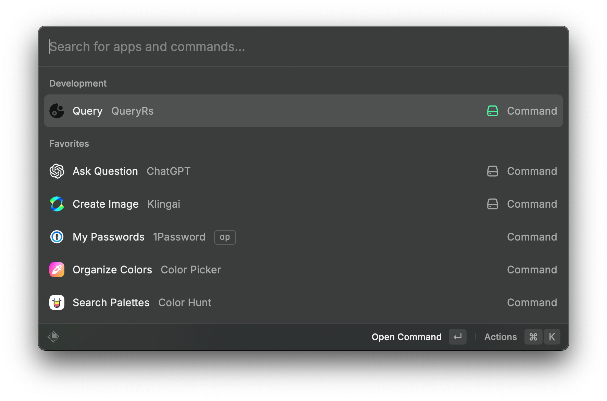
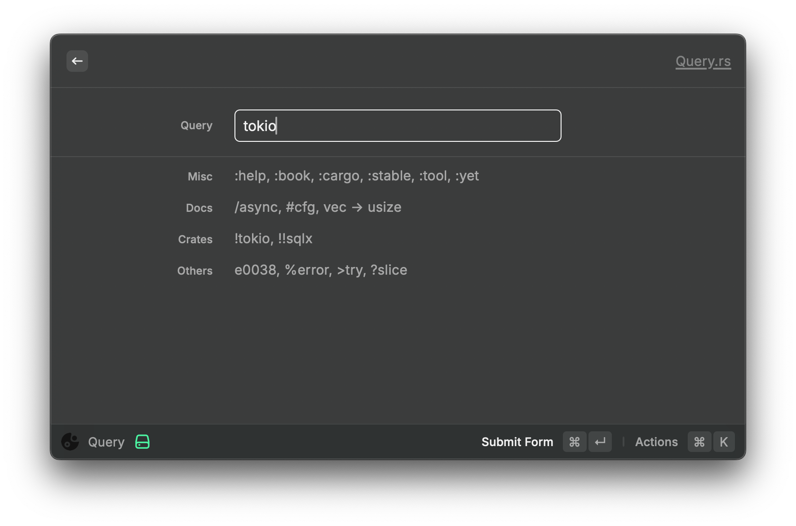
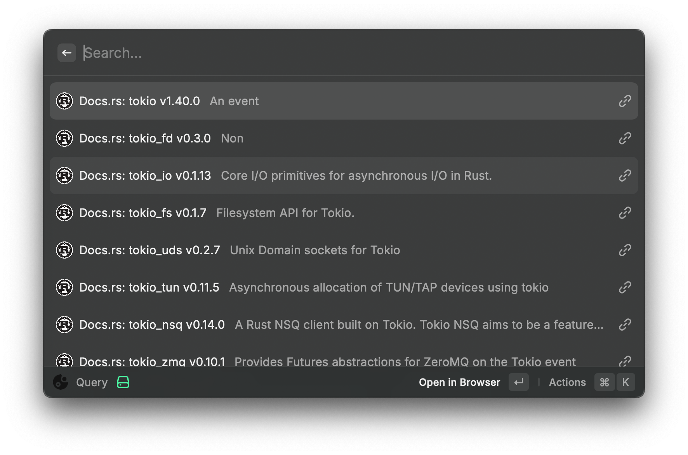

<h1 align="center">QueryRs</h1>

<a href="https://query.rs/">https://query.rs</a> Offline Version for Raycast

### Build CLI

- `cd query.rs/lib && pnpm install`
- `cd ../../cli && pnpm install && npm install -g .`

### Run Extension

- `npm install`
- `npm run dev`
